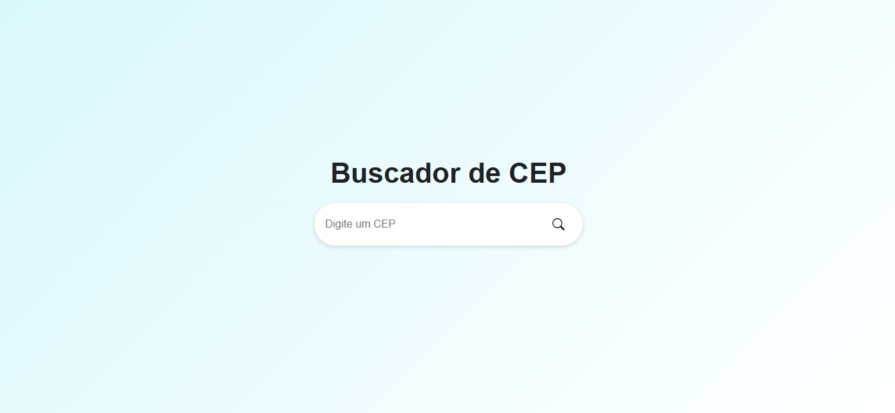

# Buscador de CEP

Este projeto é um buscador de CEP desenvolvido com React.js. Ele permite que o usuário insira um CEP e visualize as informações correspondentes, como logradouro, complemento, bairro, cidade e estado.

Validação de Entrada: Caso o usuário não digite um CEP ou digite um inválido, será exibido um alerta de erro.

Design Responsivo: A interface é adaptável, garantindo boa experiência tanto em dispositivos móveis quanto em desktops.

## Tecnologias Utilizadas

React: Biblioteca JavaScript para construção da interface do usuário.

API de CEP: Utilização de uma API para obter as informações do CEP digitado.

CSS: Estilos personalizados para tornar a aplicação visualmente agradável e responsiva
